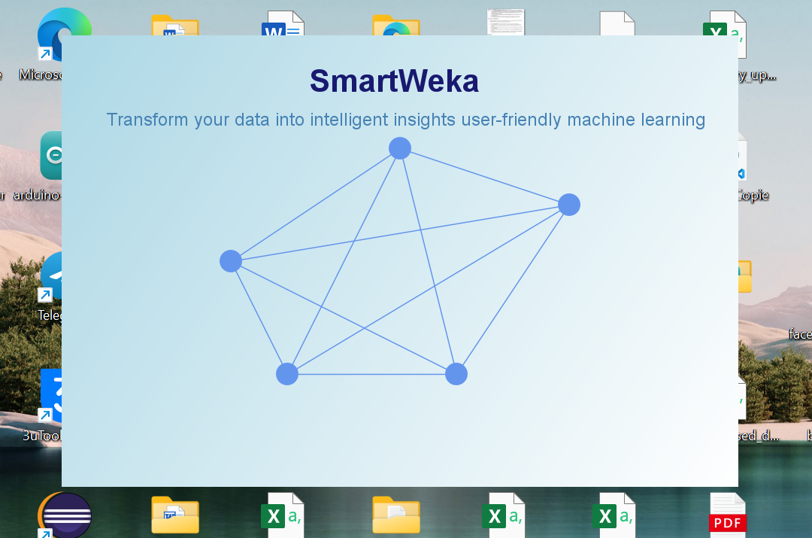
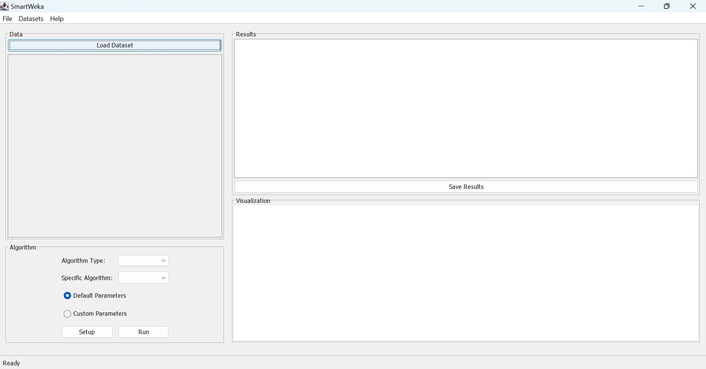
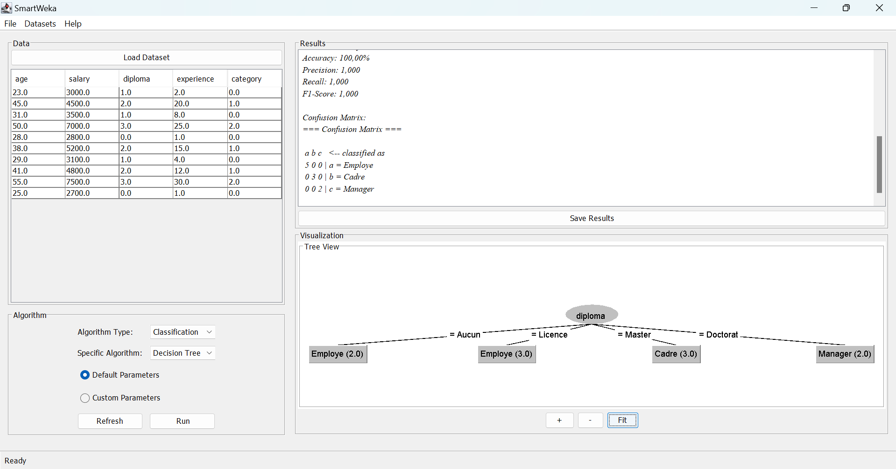

# SmartWeka

SmartWeka is a user-friendly data analysis application built in Java that leverages the capabilities of Weka for machine learning. The application allows users to load datasets, select algorithms, and visualize analysis results, making advanced data analytics accessible to everyone.

## Features

- **Load Datasets**: Supports ARFF and CSV formats.
- **Algorithm Selection**: Choose from various machine learning algorithms, including:
  - J48 (Decision Tree)
  - K-Nearest Neighbors (KNN)
  - K-Means Clustering
  - DBSCAN (Density-Based Spatial Clustering)
  - CAH (Hierarchical Clustering)
- **Results Visualization**: Display analysis results in a user-friendly interface.
- **Save Results**: Easily save analysis outcomes for future reference.
- **Version Control**: Developed using Git for efficient collaboration and version management.

## Screenshots 








## Technologies and Tools Used

- **Java**: The primary programming language for building the application.
- **Swing**: For creating a responsive and elegant graphical user interface (GUI).
- **Weka**: A powerful suite of machine learning software for data mining tasks.
- **Eclipse**: The integrated development environment (IDE) used for development.
- **WindowBuilder**: A tool for designing GUIs within Eclipse.

## Installation

To run SmartWeka locally, follow these steps:

1. **Clone the Repository**:
   ```bash
   git clone https://github.com/seifeddine-bd/smartweka.git

2. **Navigate to the Project Directory**:
    ```bash
    cd smartweka

3. **Open the Project in Eclipse**:

    Import the project into your Eclipse IDE.

4. **Run the Application**:

    Launch the main class from the Eclipse IDE.


## Future Enhancements

    Additional Algorithms: Integrate more advanced machine learning algorithms such as neural networks and random forests.
    Improved UI: Enhance the user interface using modern design libraries like JavaFX.
    Data Visualization: Implement tools for data visualization (graphs, charts).
    Data Preprocessing Tools: Add features for data cleaning and preprocessing.
    Result Export Options: Allow users to export results in various formats (PDF, Excel).
    Multilingual Support: Implement support for multiple languages.

## Contributing

Contributions are welcome! If you have suggestions or improvements, feel free to fork the repository and submit a pull request.